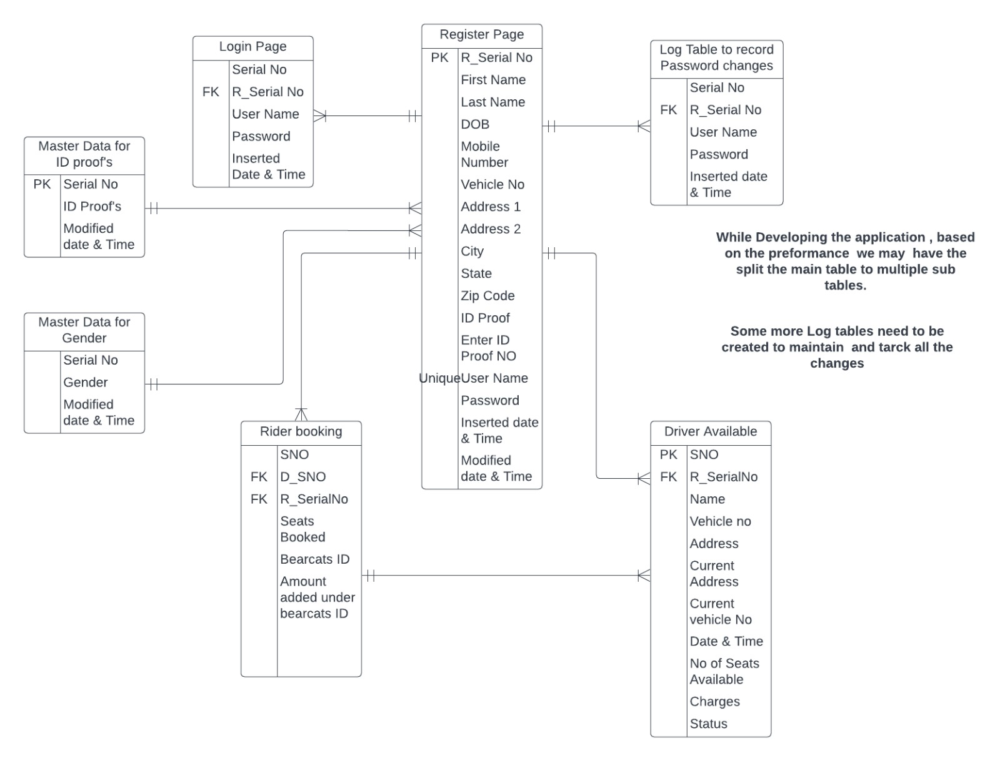

## Graduate Project 
### Contibutors
* [Sneha Bedadhala](https://github.com/snehabedadhala)
* [Ram Reddy Boppidi](https://github.com/RamReddy98)
* Pavan Kalyan Bakkani
* Sai Kumar Siddagoni
* [Ashok Babu Mannam](https://github.com/AshokBabuMannam)

[Project Board](https://github.com/users/snehabedadhala/projects/3)

we do have 2 project ideas:

1. Find your space( parking lot tracker)- Web based Application

where we can find the parking spaces across our university locations and park our vehicle as per the availability.

2. cars Fleet(Future perspective app)- Android App

This app maintains all the information of electric vehicles for an organization. where we can track vehicle health, pending bills and amount earned by the vehicles.

### Finilaized Project- Bearcat Commute

1. Two types of users
	Driver
	Rider
2. Both users have same login
	* Login page will have option to register if the user is first time user.
	* Will provide an option to reset the password.
3. After login, user selects their role
4. If selected as rider, 
	* Request Ride UI is displayed
	* List of available rides are displayed. Rider can select the appropriate one.
	* Rider can submit a request by clicking 'Request Ride' button.
5. If selected as driver,
	* Driver can enter the details of his route and submit the ride offer.
	* Driver will receive an alert when rider submits a request.
	* Driver can either accept or reject the request. 
6. If driver accepts the request, alert is sent out to rider.
7. If driver rejects the request, alert is sent out to rider.
8. Driver and Rider meets the next morning at pick up spot and drives to work/school.

I am Ram Reddy. Boppidi- Worked as software associate for 2.5 years with NTT DATA. Worked on Flexera, service now, Snow, Excel. Experienced in both operations and backend including tool monitoring. Worked with different clients for projects related to data reconciliation and database management. Experienced working in a fast-paced environment to meet client's requirements.

Hi, I am Pavan kalyan Bakkani, currently pursuing master's and  working on the project called "Bearcats commute". I did my bachelors in ece and previusly worked as a system engineer.

Myself Ashok Babu Mannam, I am having 8 years of experience in SQL server and ABBYY Flexicapture.

Working on ER diagram with different tables and relationshops between them. Moreover, gathering requirements for technical stack for the project and doing a research to integrate maps with the application.

Working on UX/UI design. Designing the user interface(preliminary visual mock-up) for the application. 

Myself Saikumar Siddagoni! I pursued my bachelor's degree in Computer science. I started my career in BPO. I worked for clients Kohl's, macy's and Lyft. My roles are subject matter expert and team leader. I'm pursuing the Master's in applied computer science to enhance my skillset.

We as a team worked together on Database schema and completed few ER diagrams related to Login, Register page

Doing a research on apis to append and integrate maps with the web application.

As a team we worked on the prototype of the project we created some of the entity diagrams and looking farward to come up with full schema of the project

Working more on the ER diagrams and relationships among them for the full databse schema and gathering the technical information.

This week we sat as a team and designed the UI interface design pages document with login page, register page, rider page and driver page. We had a sketch of front user interface.

we have created few ER diagrams for login, register, master pages and planning to complete the remaining ER diagrams for other tables.

In this mid week, we sat as team worked on database schema with ER diagrams with relationships with required tables. Further weeks will implement the database.

I have done a bit of research on google maps Api's.

1. Google is now requiring a proper API key for accessing the service. can Create a key, or create/find an existing one in your Google Developers Console.
2. [Click here for documentation](https://developers.google.com/maps/documentation/geocoding/get-api-key)
3. There are different ways to use the map apis as per our requirement and the technical stack we use.
4. API Support
   Currently the library supports full coverage of the following Google Maps APIs:
   * Geocoding
   * Elevation
   * Static Maps
   * Dynamic Maps
   * Directions
   * Distance Matrix
   * Places
   * Time Zones
   * Street View

##### Reference Links for Documentation

[Link 1](https://developers.google.com/maps/documentation) 
[Link 2](https://developers.google.com/maps/faq#:~:text=The%20Google%20Maps%20Platform%20is,retrieve%20data%20from%20Google%20Maps.) 
[Link 3](https://cloud.google.com/blog/products/maps-platform/three-ways-add-map-implementation-your-app-and-when-use-each) 
[Link 4](https://mapsplatform.google.com/pricing/#:~:text=You%20won't%20be%20charged,your%20%24200%20monthly%20credit) 
[Link 5](https://developers.google.com/maps/documentation/javascript/get-api-key)

Added relations to all the tables and discussed how to maintain the log tables in future with team

Created the relationships between the tables in the ER- Diagram and working to implement the complete database schema. While developing the application, based on the performance, we may have split the main table to multiple sub tables. Some more log tables need to be created to maintain and track all the changes.

Since, we designed ER schema last week. Now, we have completed relationships between the entities. Any required changes will be done after the review.

We created relationships among the tables and one important point is we may have to split the main table into multiple tables based on the performance efficiency.

As a team we discussed related to reports(Rider Report, Driver Report) and added those 2 reports in prototype

We have created a Trello Board(To Do List) in github repo with in the project and wiki page has been created. Moreover, we have included reports page for rider & driver with in the prototype.

In this sprint did a research on integrating the google maps api with web applications. Checked with API and the library that supports the web application. Here is the resource https://developers.google.com/maps/documentation/javascript/adding-a-google-map . Looking insights of Collaborative Realtime Mapping with Firebase, Geolocation: Displaying User or Device Position on Maps, Adding a Map and Markers to a React Application and Marker Clustering.

we added reports page to the prototype like rider report and driver report. So that there is a clear count on ride given and ride requested from both driver and rider respectively.

Completed protoype of Database Schema with all the relationships. 

Added relations to the tables, need to implement few log tables and also discussed regarding spliting the main tables based on performance. Trying to install Visual Studio 2017.

[Updated Project workflow](https://github.com/snehabedadhala/GDPTeam01/blob/main/Project%20Workflow.pdf)

We want to build the user interface (UI) pages based on our prototype, and we'll do everything we can to create the right pages for the login page, registration page, and driver page.